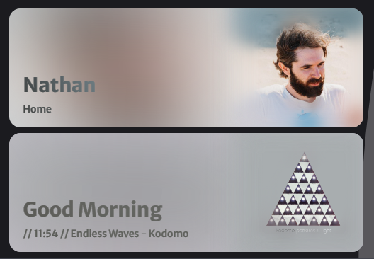

# Hero Card

A beautiful hero image and heading card for lovelace

## Support

Hey friend! Help me out for a couple of :beers: or a :coffee:!

## Options

| Name              | Type    | Requirement  | Description                                 | Default             |
| ----------------- | ------- | ------------ | ------------------------------------------- | ------------------- |
| type              | string  | **Required** | `custom:hero-card`                   |
| heading              | string  | **Optional** | Main heading                                   |        |
| subheading              | string  | **Optional** | Additional heading                                   |        |
| entity_image            | boolean  | **Optional** | Toggle whether to use an entity for the image, or an image url                  | `none`              |
| entity            | string  | **Required** | Home Assistant entity ID. The entity to be used for the image                  | `none`              |
| image_url            | string  | **Required** | URL for the image                  | `none`              |
| foreground_image            | boolean  | **Optional** | Toggle whether to show the image in the foreground                 | `none`              |

